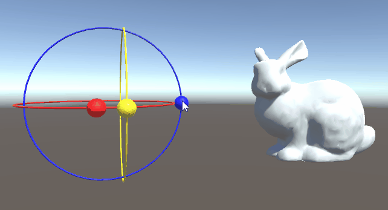

# Read and Drop Rotation Object for Unity
The following system provides a tool that allows you to control the rotation of an object from a separate object and allows the object to communicate back to the main object. 
Any number of items can be followed and sloted into place. 
This system is designed to be dropped into GUI's and was designed to function with various medical Imaging systems. The basic functionality is as shown below: 

Users can click on the spheres shown in this system to rotate an object or drag it in the direction to be rotated. 

# Updated Object Baseed On Rotating the object
This system will also optionally update it's self if another tool rotates the object by tracking the roation of the object and updating as required.
A demo of this can be seen below:

